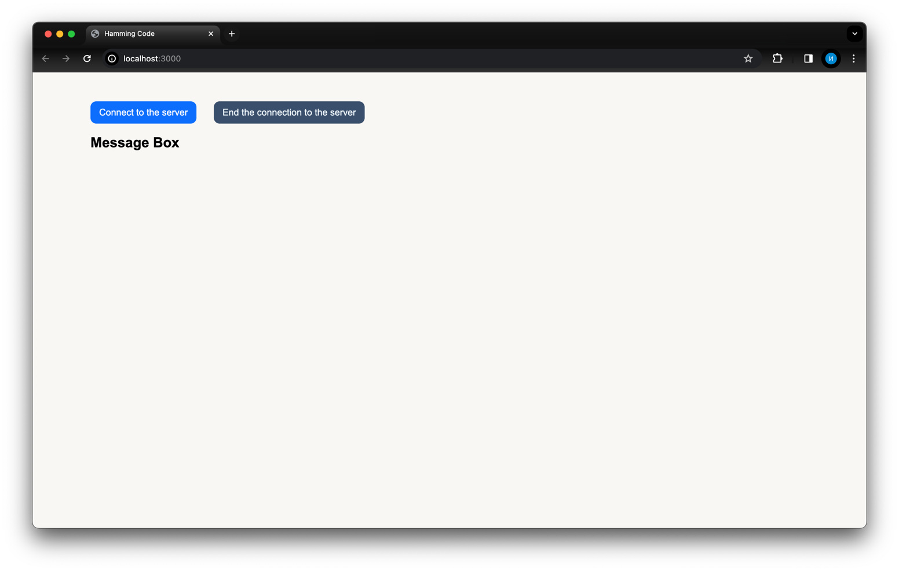
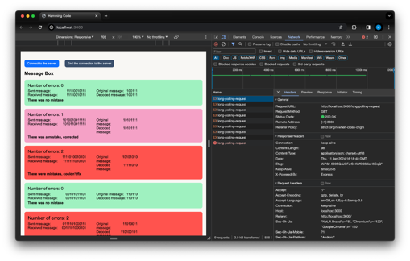
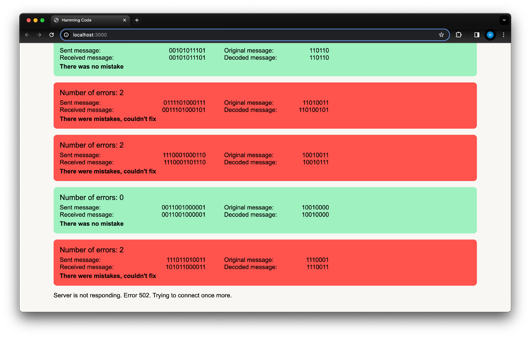

# Экспериментальное домашнее задание по курсу СТ

### Полученное задание
Реализовать поверх long polling свой канальный уровень для исправления ошибок (Код Хемминга).  

Данное задание учит идее современных беспроводных сетей, что случаются искажения битов. 
Одна из сторон случайно «портит» биты в данных.  

Нужно восстановить код или найти ошибку. На экране выводятся оригинальное сообщение, «испорченное», восстановленное. 
И можно сравнить, смогли найти ошибку или нет.  

### Введение

Для реализации поверх long polling своего канального уровня для исправления ошибок было разработано веб-приложение. 
На основе его работы можно увидеть, как и насколько эффективно работает код Хэмминга.  

Бэкенд веб-приложения генерирует случайное число, переводит его в двоичную систему счисления, 
кодирует его с помощью кода Хэмминга, добавляет бит чётности, затем случайным образом определяет кол-во ошибок в 
последовательности бит. После таймаута (2,5 сек) он отправляет на фронтенд полученную последовательность и данные для 
сбора информации по работе кода Хэммига: исходное число в двоичной форме, закодированный полином без ошибок, 
закодированный полином с ошибкой/-ами и количество сделанных ошибок.  

Фронтенд принимает вышеперечисленные данные, декодирует ошибочную последовательность, пытается её исправить, 
если это требуется, и затем выводит все результаты и данные на экран.  

Всё веб-приложение работает поверх long polling. То есть фронтенд отправляет HTTP запрос на бэкенд, он через некоторое 
время отвечает, и тогда фронтенд снова шлёт ему запрос. Или же по истечении некоторого времени запрос падает с ошибкой,
и тогда фронтенд снова шлёт запрос на бэкенд.  

### Начало работы веб-приложения

Веб-приложение встречает экраном, который приведён на рисунке ниже. Здесь есть 
кнопка «Connect to the server» и «End the connection to the server». Ниже располагается поле для вывода 
списка ответов бэкенда на запрос фронтенда.

                                    
### Начало соединения с сервером

При нажатии на кнопку «Connect to the server» флаг isPolling становится true и отправляется первый GET запрос на бэкенд,
что и продемонстрировано на рисунке ниже. После получения ответа фронтенд снова отправляет GET запрос, так как данная 
функция является зацикленной. Выйти из этого цикла можно только, если поменять флаг isPolling на false, что делается 
при нажатии на кнопку «End the connection to the server».  

Подробнее рассмотрим, какую информацию предоставляет одна карточка из списка ответов. 
В заголовке виден статус обработки запроса. Всего их может быть 4:

+ •	There was no mistake (Ошибки не было)
+ •	There was a mistake, corrupted (Ошибка была, получилось исправить)
+ •	The error was in the parity bit, corrected (Ошибка была в бите четности, получилось исправить)
+ •	There were mistakes, couldn’t fix (Ошибки были, исправить не удалось)

Цвет карточки зависит от статуса: при первом статусе фронтенд в итоге получит верную полезную нагрузку, поэтому карточка 
зелёная, при втором и третьем статусах фронтенд смог выявить, что ошибка есть, и исправить её, поэтому карточка розовая 
(предупреждающая). При четвёртом статусе карточка будет красной, так как в таком случае у нас возникает две ошибки,
которые невозможно исправить с помощью кода Хемминга.  

Справа в заголовке карточки отображается количество ошибок. 
Ниже отображаются следующие последовательности: отправленное сообщение, полученное сообщение, оригинальное сообщение, 
раскодированное сообщение. Раскроем подробнее смысл каждой из них.   

+ **Полученное сообщение** – это испорченная закодированная последовательность. Если бы кодом Хемминга пользовались в 
реальных условиях (а не для отображения статистики работы этого кода), то только это сообщение и приходило бы получателю.
+ **Отправленное сообщение** – закодированная последовательность символов, которая отправляется из бэкенда. Она ещё не имеет 
никаких ошибок. Требуется для вывода статистики и проверки на правильную работу веб-приложения.
+ **Раскодированное сообщение** – последовательность, которую получил фронтенд после процесса декодирования сообщения. 
Это и есть данные, которые клиент должен получить от сервера.
+ **Оригинальное сообщение** – исходные данные, которые и требовалось отправить получателю без каких-либо искажений. 
В данном веб-приложении требуется для вывода статистики и проверки на правильную работу написанного алгоритма.  

### Окончание соединения с сервером
При нажатии на кнопку «End the connection to the server» флаг isPolling меняется на false, функция отправки запросов 
на бэкенд выходит из цикла, запросы больше не шлются.

